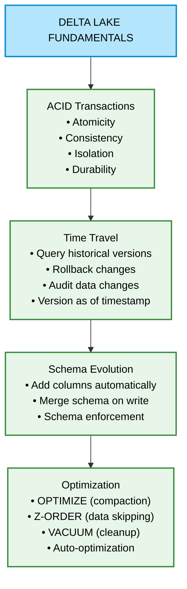
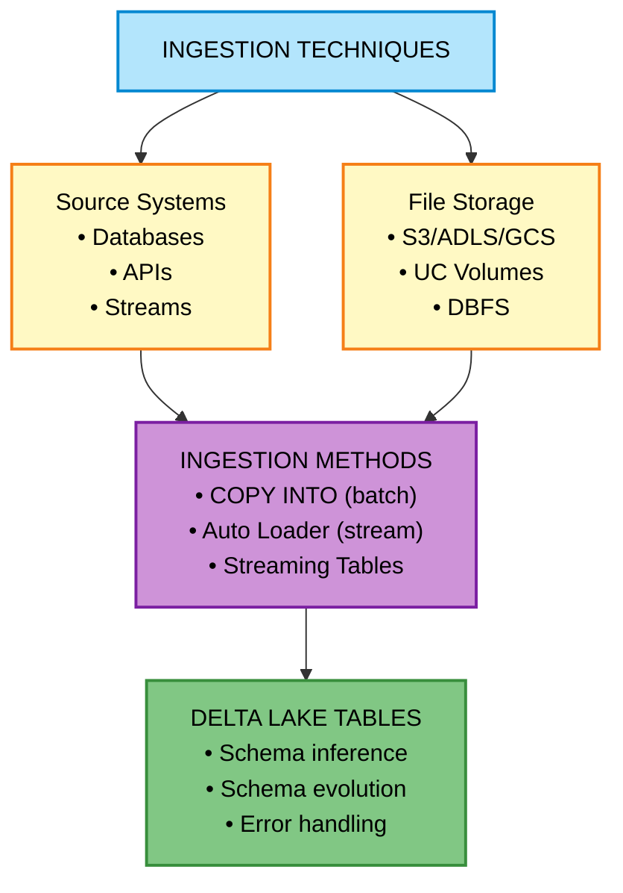
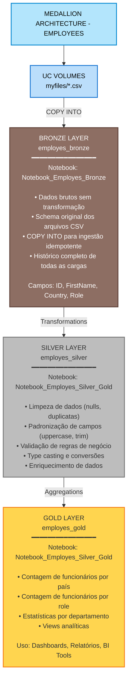
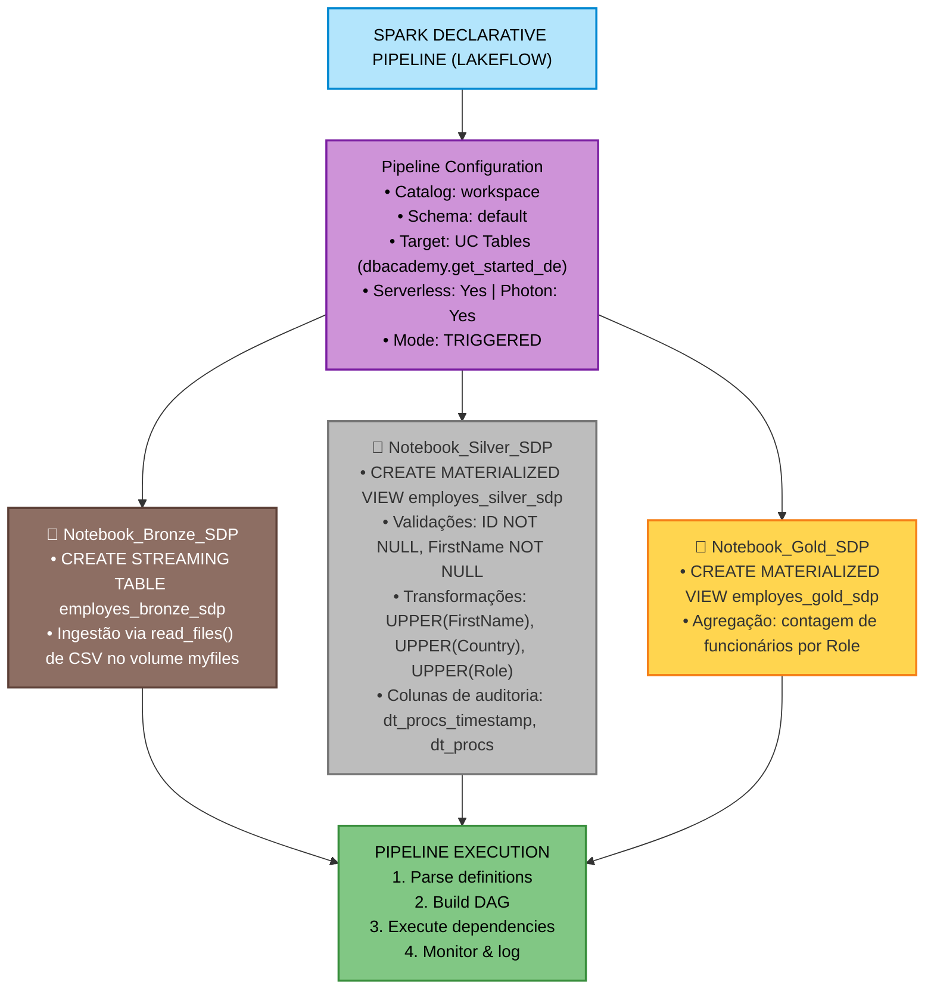
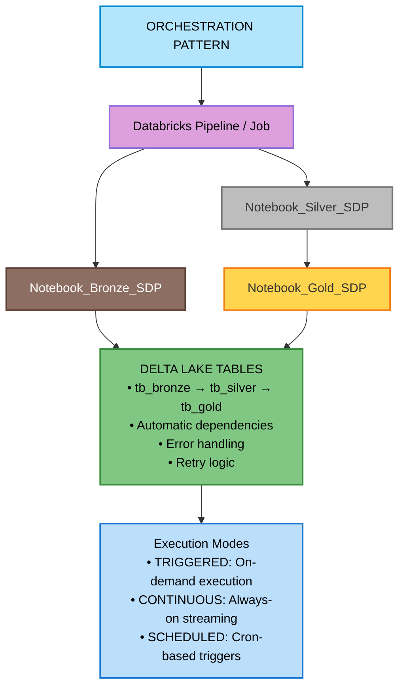
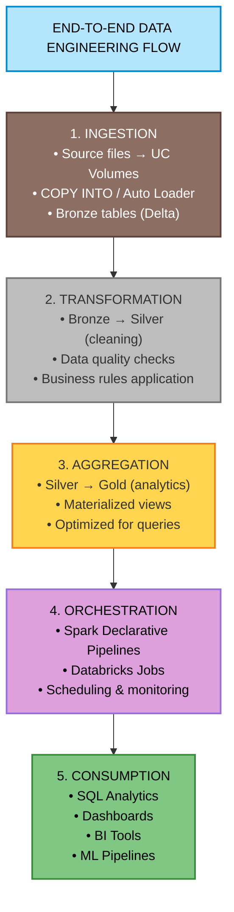

# Get Started with Data Engineering - Databricks

## Visão Geral

Módulo de treinamento oficial Databricks focado em fundamentos de Engenharia de Dados. Este curso aborda conceitos essenciais do Lakehouse, Delta Lake, técnicas de ingestão, arquitetura Medallion e orquestração de pipelines.

**Objetivo:** Consolidar competências técnicas em Databricks conectando práticas tradicionais de ETL às abordagens modernas de engenharia de dados.

---

## Estrutura do Módulo

```
01_Get_Started_with_Data_Engineering/
├── README.md (este arquivo)
├── 01 - Delta Lake Fundamentals/
│   ├── 01-Notebook
│   ├── 02-Notebook
│   └── 03-Notebook
├── 02 - Ingestion Techniques/
│   └── 04-05-Notebook
├── Medallion Architecture/
│   ├── Notebook_Employes_Bronze
│   └── Notebook_Employes_Silver_Gold
├── Pipeline_bronze_silver_gold_sdp/
│   (pipeline configurado para usar os notebooks do diretório Orchestration/)
└── Orchestration/
    ├── Notebook_Bronze_SDP
    ├── Notebook_Silver_SDP
    └── Notebook_Gold_SDP
```

---

## Módulos de Aprendizado

### 1. Delta Lake Fundamentals

**Diretório:** \`01 - Delta Lake Fundamentals/\`

**Descrição:**  
Fundamentos do Delta Lake, o formato de armazenamento open-source que traz confiabilidade para Data Lakes.

**Conceitos Abordados:**



**Notebooks:**
- \`01-Notebook\` - Criação de tabelas Delta e operações básicas
- \`02-Notebook\` - Time Travel e versionamento
- \`03-Notebook\` - Otimização e manutenção

**Comandos-Chave:**
```sql
-- Criar tabela Delta
CREATE TABLE employees USING DELTA AS SELECT * FROM source;

-- Time Travel
SELECT * FROM employees VERSION AS OF 1;
SELECT * FROM employees TIMESTAMP AS OF '2024-01-01';

-- Otimização
OPTIMIZE employees ZORDER BY (country, role);

-- Limpeza
VACUUM employees RETAIN 168 HOURS;
```

---

### 2. Ingestion Techniques

**Diretório:** \`02 - Ingestion Techniques/\`

**Descrição:**  
Técnicas modernas de ingestão de dados para o Lakehouse.

**Fluxo de Ingestão:**



**Técnicas Implementadas:**

1. **COPY INTO (Batch)**
   - Ingestão batch de arquivos
   - Idempotente (evita duplicação)
   - Ideal para cargas históricas

2. **Auto Loader (Streaming)**
   - Ingestão incremental automática
   - Detecta novos arquivos automaticamente
   - Schema inference e evolution
   - Escalável para milhões de arquivos

3. **Streaming Tables**
   - Processamento contínuo
   - Exatamente uma vez (exactly-once)
   - Gerenciamento automático de checkpoints

**Notebooks:**
- \`04-05-Notebook\` - COPY INTO, Auto Loader e técnicas de ingestão

**Exemplos de Código:**

```sql
-- COPY INTO (Batch)
COPY INTO employees_bronze
FROM '/Volumes/catalog/schema/volume/data/'
FILEFORMAT = CSV
FORMAT_OPTIONS ('header' = 'true', 'inferSchema' = 'true');
```

```sql
-- Auto Loader (Streaming)
CREATE OR REFRESH STREAMING TABLE employees_bronze
AS SELECT * 
FROM STREAM read_files(
  '/Volumes/catalog/schema/volume/data/',
  format => 'csv',
  header => 'true',
  inferSchema => 'true'
);
```

---

### 3. Medallion Architecture

**Diretório:** \`Medallion Architecture/\`

**Descrição:**  
Implementação prática da arquitetura Medallion (Bronze-Silver-Gold) com dados de funcionários.

**Arquitetura Completa:**



**Notebooks:**
- \`Notebook_Employes_Bronze\` - Ingestão na camada Bronze
- \`Notebook_Employes_Silver_Gold\` - Transformação Silver e agregação Gold

**Padrões Implementados:**

| Camada | Objetivo | Tipo de Dados | Tipo SDP | Processamento |
|--------|----------|---------------|----------|---------------|
| Bronze | Ingestão | Raw/Bruto | Streaming Table | Nenhum |
| Silver | Limpeza | Validado | Materialized View | ETL |
| Gold | Analytics | Agregado | Materialized View | Business Logic |

---

### 4. Pipeline Bronze-Silver-Gold SDP

**Diretório:** \`Pipeline_bronze_silver_gold_sdp/\`

**Descrição:**  
Implementação de pipeline declarativo usando Spark Declarative Pipelines (SDP) - Databricks Lakeflow.

**Arquitetura SDP:**



**Características:**
- Declarativo: Define o "o quê", não o "como"
- Gerenciamento automático de dependências
- Retry automático em falhas
- Monitoramento integrado
- Lineage tracking

**Componentes:**
- \`transformations/my_transformation.py\` - Definições de tabelas e transformações

---

### 5. Orchestration

**Diretório:** \`Orchestration/\`

**Descrição:**  
Exemplos de orquestração de pipelines usando Spark Declarative Pipelines com notebooks separados por camada.

**Arquitetura de Orquestração:**



**Notebooks:**
- \`Notebook_Bronze_SDP\` - Streaming Table (Bronze layer - ingestão via Auto Loader)
- \`Notebook_Silver_SDP\` - Materialized View (Silver layer - transformações e validação)
- \`Notebook_Gold_SDP\` - Materialized View (Gold layer - agregações analytics)

**Padrão de Orquestração:**

1. **Separação por Camada**
   - Cada notebook representa uma camada
   - Facilita manutenção e debugging
   - Permite execução independente

2. **Gestão de Dependências**
   - Pipeline gerencia ordem de execução
   - Retry automático em falhas
   - Paralelização quando possível

3. **Monitoramento**
   - Dashboard de pipeline integrado
   - Logs detalhados por notebook
   - Alertas em falhas

---

## Conceitos-Chave Aprendidos

### Delta Lake
- ACID transactions para Data Lakes
- Time Travel para auditoria e rollback
- Schema evolution automática
- Otimização com OPTIMIZE e Z-ORDER
- Gerenciamento de storage com VACUUM

### Lakehouse
- Unificação de Data Lake e Data Warehouse
- Performance de warehouse com flexibilidade de lake
- Governança com Unity Catalog
- Suporte a SQL, Spark, Python, Scala

### Medallion Architecture
- Bronze: Dados brutos (raw)
- Silver: Dados limpos e validados
- Gold: Dados agregados para analytics
- Separação clara de responsabilidades
- Rastreabilidade completa

### Spark Declarative Pipelines
- Definições declarativas vs imperativas
- Gerenciamento automático de estado
- Monitoring e observability integrados
- Simplified deployment

### Ingestão de Dados
- COPY INTO para batch
- Auto Loader para streaming
- Schema inference e evolution
- Error handling e dead letter queues

---

## Fluxo de Trabalho Completo



---

## Comandos Úteis

### Delta Lake Operations
```sql
-- Criar tabela Delta
CREATE TABLE employees USING DELTA AS SELECT * FROM source;

-- Time Travel
SELECT * FROM employees VERSION AS OF 1;
SELECT * FROM employees TIMESTAMP AS OF '2024-01-01';

-- Histórico de versões
DESCRIBE HISTORY employees;

-- Otimização
OPTIMIZE employees ZORDER BY (country, department);

-- Limpeza
VACUUM employees RETAIN 168 HOURS;
```

### Ingestão
```sql
-- COPY INTO (batch, idempotente)
COPY INTO target_table
FROM '/path/to/files/'
FILEFORMAT = CSV
FORMAT_OPTIONS ('header' = 'true');

-- Auto Loader (streaming)
CREATE OR REFRESH STREAMING TABLE bronze_table
AS SELECT * 
FROM STREAM read_files('/path/', format => 'csv', header => 'true');
```

### Unity Catalog
```sql
-- Usar catálogo e schema
USE CATALOG dbacademy;
USE SCHEMA get_started_de;

-- Listar volumes
LIST '/Volumes/catalog/schema/volume/';

-- Ver tabelas
SHOW TABLES;
DESCRIBE EXTENDED table_name;
```

---

## Como Executar

### Pré-requisitos
- Workspace Databricks configurado
- Unity Catalog habilitado
- Catálogo \`dbacademy\` e schema \`get_started_de\` criados
- Volumes configurados com dados de exemplo
- Serverless compute ou cluster attached

### Ordem de Execução

1. **Delta Lake Fundamentals**
   ```
   01-Notebook → 02-Notebook → 03-Notebook
   ```

2. **Ingestion Techniques**
   ```
   04-05-Notebook
   ```

3. **Medallion Architecture**
   ```
   Notebook_Employes_Bronze → Notebook_Employes_Silver_Gold
   ```

4. **Pipeline SDP**
   ```
   Pipeline ja configurado no Lakeflow apontando para os 3 notebooks do diretório Orchestration/
   Executar pipeline pelo editor (botao Start/Run)
   ```

5. **Orchestration**
   ```
   Criar Pipeline/Job com os 3 notebooks de orquestração
   Configurar dependências: Bronze → Silver → Gold
   Executar
   ```

---

## Boas Práticas Implementadas

### Arquitetura
- Separação clara de camadas (Bronze-Silver-Gold)
- Idempotência em operações de ingestão
- Versionamento com Delta Lake
- Governança com Unity Catalog

### Performance
- OPTIMIZE e Z-ORDER para otimização de queries
- Particionamento quando apropriado
- Caching de dados frequentemente acessados
- Auto Loader para ingestão incremental eficiente

### Qualidade
- Schema enforcement
- Data validation na camada Silver
- Audit columns (created_at, updated_at)
- Dead letter queues para registros inválidos

### Operacional
- Monitoring integrado com pipelines
- Logs detalhados de execução
- Retry automático em falhas transientes
- Alertas em falhas críticas

---

## Próximos Passos

- Advanced Delta Lake features (Liquid Clustering)
- Change Data Capture (CDC) com APPLY CHANGES
- Streaming avançado com watermarks
- Data quality monitoring automatizado
- CI/CD com Declarative Automation Bundles (DABs)
- Integration testing de pipelines
- MLOps com MLflow

---

## Recursos Adicionais

- [Documentação Oficial Databricks](https://docs.databricks.com/)
- [Delta Lake Documentation](https://docs.delta.io/)
- [Spark Declarative Pipelines Guide](https://docs.databricks.com/workflows/delta-live-tables/)
- [Unity Catalog Best Practices](https://docs.databricks.com/data-governance/unity-catalog/)

---

## Autor

**Fabio Medeiros**  
Engenheiro de Dados  
Email: fabiolrm78@gmail.com  
Telefone: (21) 99663-7177

Desenvolvido como parte do treinamento oficial Get Started with Databricks for Data Engineering.
