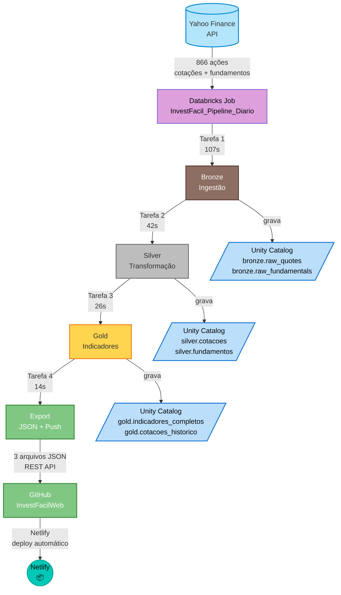

# InvestFacil - Pipeline de Dados B3

Pipeline de dados para ingestao e processamento de acoes da B3 com calculo de indicadores fundamentalistas.

## Arquitetura Medallion

O pipeline segue a arquitetura Medallion com 3 camadas + exportacao:



### Bronze (Ingestao)
- **Notebook**: `01_Bronze_Ingestao_B3.py`
- **Fonte**: Yahoo Finance API (yfinance) + brapi.dev
- **Frequencia**: Diaria
- **Output**: 
  - `investfacil_catalog.bronze.raw_quotes` (866 registros)
  - `investfacil_catalog.bronze.raw_fundamentals` (866 registros)

### Silver (Transformacao)
- **Notebook**: `02_Silver_Transformacao.py`
- **Processamento**: Limpeza, normalizacao, mapeamento de nomes (74 empresas) e setores (11 setores traduzidos para portugues)
- **Output**:
  - `investfacil_catalog.silver.cotacoes` (6.062 registros)
  - `investfacil_catalog.silver.fundamentos` (866 registros)

### Gold (Indicadores)
- **Notebook**: `03_Gold_Indicadores.py`
- **Calculos**: 27 indicadores por acao
  - Dividend Yield, P/L (Preco/Lucro), ROE, LPA
  - Volatilidade, Momentum 30d, Beta
  - Volume medio, Valor de mercado, Variacao percentual
- **Output**:
  - `investfacil_catalog.gold.indicadores_completos` (41 acoes x 27 colunas)
  - `investfacil_catalog.gold.cotacoes_historico`

### Export (JSON + Push GitHub)
- **Notebook**: `04_Export_JSON_S3.py`
- **Formato**: JSON para consumo web
- **Arquivos**: indicadores.json, historico.json, metadata.json
- **Destino**: `InvestFacilWeb/Import-Json-InvestFacil/`
- **Push automatico**: Via GitHub REST API com token do Databricks Secret

## Job Diario

**Nome**: InvestFacil_Pipeline_Diario  
**ID**: 679490622792902  
**Schedule**: Diariamente as 19h (apos fechamento do mercado)
- Tarefas: Bronze -> Silver -> Gold -> Export
- Compute: Serverless
- Duracao media: ~3 minutos (189s)
- Tempo por etapa: Bronze 107s | Silver 42s | Gold 26s | Export 14s

## Dados Processados

- **866 acoes** coletadas na Bronze (raw)
- **41 acoes** filtradas e processadas na Gold (top Ibovespa)
- **27 indicadores** calculados por acao
- **Dados atualizados** diariamente
- Nomes e setores em portugues

## Tecnologias

- **Databricks**: Plataforma de processamento (Serverless)
- **PySpark**: Transformacoes de dados
- **Delta Lake**: Armazenamento (tabelas ACID)
- **Yahoo Finance API**: Fonte de dados gratuita
- **GitHub REST API**: Push automatico dos JSONs

## Estrutura de Arquivos

```
Databricks/InvestFacil/
  notebooks/
    00_ConfigToken.ipynb        - Configuracao de tokens/secrets
    01_Bronze_Ingestao_B3.py     - Ingestao de dados B3
    02_Silver_Transformacao.py   - Transformacao e mapeamento
    03_Gold_Indicadores.py       - Calculo de indicadores
    04_Export_JSON_S3.py         - Exportacao e push GitHub
    VALIDACAO.py                 - Validacao dos dados
  config/                        - Configuracoes
  docs/                          - Documentacao
  README.md                      - Este arquivo
  ManualExec.md                  - Manual de execucao passo a passo
```

## Secrets Necessarios

- Scope: `investfacil`
- Key: `github_token` (GitHub PAT para push automatico)

## GitHub

- Repo pipeline: `flrmedeiros78/Databricks` (pasta `InvestFacil/`)
- Repo web: `flrmedeiros78/InvestFacilWeb` (pasta `Import-Json-InvestFacil/`)

## Aplicacao Web

Os dados processados alimentam a aplicacao web InvestFacilWeb:
`https://github.com/flrmedeiros78/InvestFacilWeb`

## Autor

Desenvolvido com Databricks por fabiolrm78@gmail.com
